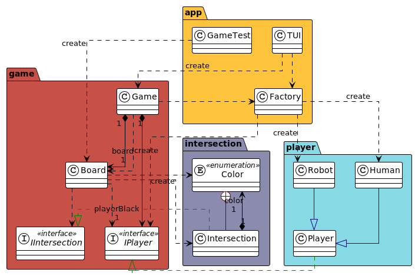

# Projet jeu de Go

Note 14/20

Le code de la classe Robot est vide. La classe ne sert donc à rien. je pense que vous n'avez pas bien compris l'exercice.
On ne sait pas trop pourquoi la partie s'arrête.
Quand un joueur suicide une pierre elle est prise mais pas son groupe ce qui est incohérent.
Pour les auteurs mettez le nom de famille en entier sinon je perds du temps à chercher qui c'est sur scodoc.

Projet effectué dans le cadre du cours de Qualité de Développement de la deuxième année de BUT Informatique. 
Ce projet a pour objectif de nous apprendre les principes SOLID et à les respecter.

## Auteurs
- [Rémi L.](https://github.com/remi-lem)
- [Esteban C.R.](https://github.com/EstebanCRz)
- [Clothilde P.](https://github.com/TorielLink)

## Rapport

[Rapport-QDEV_CARDAILLAC-RODRIGUEZ_LEMAIRE_PROUX.pdf](Rapport-QDEV_CARDAILLAC-RODRIGUEZ_LEMAIRE_PROUX.pdf)

## Principes SOLID et Design Pattern
Nous respectons les principes SOLID suivants : 
- DIP : Pour chaque paquetage qui pourrait varier, nous "cachons" les classes concrètes derrière une interface.
- SRP : Chaque paquetage a un et un seul axe de changement.
- OCP : La classe Player, par exemple, est fermée à la modification directe, mais ouverte à l'extension
(avec Human et Robot).
- Patron de création Factory : pour éviter la dépendance d'un paquet stable a un instable.
- DRY (Don't Repeat Yourself) : Pas de redondance dans le code.

## Diagramme d'Architecture / de Paquetage

---

## Languages utilisés

## Outils utilisés
### IDE :

### Travail collaboratif :

### Modélisation du diagramme :

