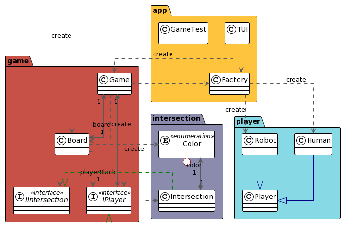

# Projet jeu de Go

Projet effectué dans le cadre du cours de Qualité de Développement de la deuxième année de BUT Informatique. 
Ce projet a pour objectif de nous apprendre les principes SOLID et à les respecter.

## Auteurs
- [Rémi L.](https://github.com/remi-lem)
- [Esteban C.R.](https://github.com/EstebanCRz)
- [Clothilde P.](https://github.com/TorielLink)

## Fonctionnalités de l'application
### Sprint 1
- Diagramme d'Architecture (de Paquetage)
- Interpreter qui accepte des commandes
- Mise en place du protocole GTP
- Commande QUIT
- Commande BOARDSIZE
- Commande SHOW_BOARD

### Sprint 2
- Commande CLEAR_BOARD
- Commande GENMOVE
- Commande PLAY
- Commande FINAL_SCORE
- Capture d'une ou d'un groupe de pierres
- Jeux de tests

### Sprint 3
- Jeu hors GTP (joueurs humains ou robots)
- Commande PLAYER
- Commande PLAY pass
- Commande SET_HANDICAPS
- Commande UNDO
- Bot qui joue aléatoirement

## Améliorations possibles
- Gérer les suicides
- Gérer la règle du KO
- Coder un bot qui joue selon les règles du jeu de Go

## Principes SOLID et Design Pattern
Nous respectons ces principes SOLID : 
- DIP : Pour chaque paquetage qui pourrait varier, nous "cachons" les classes concrètes derrière une interface.
- SRP : Chaque paquetage a un et un seul axe de changement.
- OCP : La classe Player, par exemple, est fermée à la modification directe, mais ouverte à l'extension
(avec Human et Robot).
- Patron de création Factory : pour éviter la dépendance d'un paquet stable a un instable.
- DRY (Don't Repeat Yourself) : Pas de redondance dans le code.

## Diagramme d'Architecture / de Paquetage

---

## Languages utilisés

## Outils utilisés
### IDE :

### Travail collaboratif :

